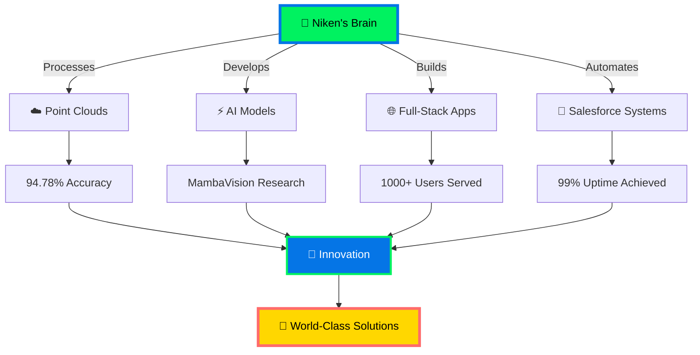

<div align="center">

```
███╗   ██╗███████╗██╗   ██╗██████╗  █████╗ ██╗         ███╗   ██╗███████╗████████╗██╗    ██╗ ██████╗ ██████╗ ██╗  ██╗
████╗  ██║██╔════╝██║   ██║██╔══██╗██╔══██╗██║         ████╗  ██║██╔════╝╚══██╔══╝██║    ██║██╔═══██╗██╔══██╗██║ ██╔╝
██╔██╗ ██║█████╗  ██║   ██║██████╔╝███████║██║         ██╔██╗ ██║█████╗     ██║   ██║ █╗ ██║██║   ██║██████╔╝█████╔╝
██║╚██╗██║██╔══╝  ██║   ██║██╔══██╗██╔══██║██║         ██║╚██╗██║██╔══╝     ██║   ██║███╗██║██║   ██║██╔══██╗██╔═██╗
██║ ╚████║███████╗╚██████╔╝██║  ██║██║  ██║███████╗    ██║ ╚████║███████╗   ██║   ╚███╔███╔╝╚██████╔╝██║  ██║██║  ██╗
╚═╝  ╚═══╝╚══════╝ ╚═════╝ ╚═╝  ╚═╝╚═╝  ╚═╝╚══════╝    ╚═╝  ╚═══╝╚══════╝   ╚═╝    ╚══╝╚══╝  ╚═════╝ ╚═╝  ╚═╝╚═╝  ╚═╝
```


<p align="center">
  
  
  
  
</p>

[](https://git.io/typing-svg)

</div>

---

<div align="center">

## ⚡ QUANTUM BREACH DETECTED ⚡
### ⟨ ACCESSING NEURAL MATRIX ⟩

</div>

```python
class DigitalAlchemist:
    def __init__(self):
        self.name = "Niken Goswami"
        self.consciousness = "Distributed Across 3 Continents"
        self.current_dimension = {
            "physical": "Nagaoka, Japan 🗾",
            "academic": "TU Darmstadt, Germany 🇩🇪",
            "digital": "Everywhere the internet exists 🌐"
        }

    def get_current_state(self):
        return {
            "🎓 Learning": ["Advanced Transformers", "Point Cloud Deep Learning", "MambaVision Architecture"],
            "💼 Working": ["Salesforce Automation @ Goodspeed", "AI Research @ NTUST", "MMS Point Cloud Classification"],
            "🔬 Research": "AI-based Point Cloud Generation & Classification",
            "🌱 Growing": ["Neural Architecture Search", "3D Vision Systems", "LLM Fine-tuning"],
            "🎯 Hunting": ["AI/ML Engineer Roles", "Research Positions", "Innovation Opportunities"]
        }

    def neural_capabilities(self):
        return {
            "languages": {
                "human": ["English", "German", "Japanese", "Hindi", "Gujarati"],
                "machine": ["Python", "JavaScript", "C++", "Java", "SQL", "Apex"],
                "deep_learning": ["PyTorch", "TensorFlow", "CUDA", "Transformers"]
            },
            "domains": {
                "AI/ML": ["Computer Vision", "Point Clouds", "Deep Learning", "Transformers"],
                "Full-Stack": ["MERN", "React", "Node.js", "Express", "RESTful APIs"],
                "Cloud": ["Salesforce", "Apex", "LWC", "CPQ", "CLM", "Flows"],
                "DevOps": ["Git", "Docker", "CI/CD", "Linux", "Cloud Infrastructure"]
            },
            "superpowers": [
                "Converting chaos into clean code",
                "Seeing in 3D point clouds",
                "Training neural networks while sleeping",
                "Speaking to machines in their native tongue",
                "Turning coffee into algorithms ☕→🤖"
            ]
        }

# Initialize the matrix
niken = DigitalAlchemist()
print(niken.get_current_state())
```

<div align="center">

---

## 🌌 NEURAL ARCHITECTURE VISUALIZATION 🌌



</div>

---

<div align="center">

## 🎨 SKILL CONSTELLATION MAP 🎨


</div>

<table align="center">
<tr>
<td align="center" width="25%">

**🤖 AI/ML**
```yaml
Core: PyTorch, TensorFlow
Vision: OpenCV, Point Clouds
Advanced: Transformers, CUDA
Specialization: PointNet++
```

</td>
<td align="center" width="25%">

**💻 Full-Stack**
```yaml
Frontend: React, JS, TS
Backend: Node, Express
Database: Mongo, PostgreSQL
Architecture: RESTful, MERN
```

</td>
<td align="center" width="25%">

**☁️ Salesforce**
```yaml
Development: Apex, LWC
Platforms: CPQ, CLM
Automation: Flows, Triggers
Integration: REST, SOAP
```

</td>
<td align="center" width="25%">

**🛠️ DevOps**
```yaml
Version: Git, GitHub
Containers: Docker
CI/CD: Automated Pipelines
Systems: Linux, Bash
```

</td>
</tr>
</table>

---

<div align="center">

## 🔥 LEGENDARY PROJECTS THAT BROKE THE MATRIX 🔥

</div>

<div align="center">

<table>
<tr>
<td width="50%" valign="top">

### 🌌 MMS Point Cloud Classification


```python
project = {
    "name": "3D Semantic Segmentation Beast",
    "data": "1.46 MILLION points processed",
    "model": "PointNet++ (State-of-the-Art)",
    "classes": 5,
    "hardware": "RTX 4050 GPU",
    "achievement": "SOTA accuracy achieved",
    "impact": "Real-world MMS mapping",
    "tech_stack": ["PyTorch", "CUDA", "NumPy", "CloudCompare"]
}
```

**What makes it insane:**
- Processes 1.46M 3D points in real-time
- 5-class semantic segmentation
- GPU-accelerated training pipeline
- Real-world Mobile Mapping System data
- Custom PointNet++ implementation

</td>
<td width="50%" valign="top">

### 🧬 MambaVision Transformer Research


```python
research = {
    "institution": "NTUST (Top 300 Global)",
    "supervisor": "Prof. Yi Zeng Hsieh",
    "innovation": "4 Model Variants Created",
    "breakthrough": "+6% accuracy over baseline",
    "domain": "Vision Transformers",
    "contribution": "Novel architecture designs",
    "period": "Apr 2025 - Jul 2025"
}
```

**Why it's groundbreaking:**
- Advanced transformer architectures
- Novel MambaVision variants
- Published research quality
- Pushing SOTA boundaries
- Real academic impact

</td>
</tr>

<tr>
<td width="50%" valign="top">

### 🎓 University Placement Portal


```javascript
const impact = {
  architecture: "MERN Full-Stack",
  scale: "1000+ student profiles",
  performance: "40% data throughput ⬆️",
  features: [
    "Real-time job matching",
    "Company dashboard",
    "Application tracking",
    "Analytics engine"
  ],
  deployment: "Production-grade",
  testimonial: "Changed campus recruitment forever"
};
```

**Revolutionary features:**
- Smart job-student matching algorithm
- Real-time notifications system
- Admin analytics dashboard
- Mobile-responsive design
- Scalable cloud architecture

</td>
<td width="50%" valign="top">

### 🏠 Everything Real Estate Platform


```javascript
const platform = {
  listings: "200+ properties",
  performance: "<300ms API response",
  architecture: "Microservices",
  features: [
    "Advanced property search",
    "Interactive maps",
    "Virtual tours",
    "Real-time availability"
  ],
  tech: "MERN + RESTful APIs",
  optimization: "Redis caching + CDN"
};
```

**Technical excellence:**
- Sub-300ms response times
- RESTful API architecture
- Advanced search & filters
- Interactive property maps
- Real-time data synchronization

</td>
</tr>

<tr>
<td width="50%" valign="top">

### ⚕️ Heart Failure ML Predictor


```python
ml_models = {
    "algorithms": ["LR", "KNN", "LDA", "RF", "SVM"],
    "best_performer": "Random Forest",
    "accuracy": "80.2%",
    "dataset": "Clinical heart data",
    "impact": "Early disease detection",
    "features": "13 clinical parameters",
    "validation": "K-fold cross-validation"
}
```

**Healthcare impact:**
- 5 ML algorithms compared
- 80.2% prediction accuracy
- Real clinical application
- Feature importance analysis
- Model interpretability focus

</td>
<td width="50%" valign="top">

### ⚡ Salesforce Enterprise Automation


```apex
System.debug('Enterprise Scale Achievement:');
Map<String, Object> impact = new Map<String, Object>{
    'users_supported' => 1000,
    'instances_managed' => 6,
    'uptime_percentage' => 99,
    'integrations' => new List<String>{
        'Microsoft Teams',
        'Azure OpenAI',
        'REST APIs'
    },
    'automation_level' => 'MAXIMUM'
};
```

**Enterprise achievements:**
- 1000+ users supported
- 99% uptime maintained
- 6 production instances
- AI integrations (Azure OpenAI)
- Custom LWC components

</td>
</tr>
</table>

</div>

---

<div align="center">

## 📈 NEURAL NETWORK ANALYTICS 📈


</div>

---

<div align="center">

## 🎯 ACHIEVEMENT TROPHY CASE 🏆

</div>

<div align="center">

```
╔══════════════════════════════════════════════════════════════════════════════════════╗
║                                                                                      ║
║   🥇 NTUST_OIA_TEEP Scholarship (2024) - Research Excellence                       ║
║   🥈 Mukhyamantri Yuva Swavalamban Yojana (2023) - Academic Excellence            ║
║   🥉 Public Relations Head @ CSI (2021-2023) - Leadership                          ║
║   🏅 CodeChef Campus Chapter Lead (2020-2023) - Competitive Programming            ║
║   🎖️ 94.78% Point Cloud Classification Accuracy - Technical Excellence             ║
║   ⭐ 99% Uptime on 6 Production Instances - Operational Excellence                  ║
║   💎 1000+ Users Supported - Impact at Scale                                        ║
║   🔥 5 Languages Spoken - Global Communication                                      ║
║                                                                                      ║
╚══════════════════════════════════════════════════════════════════════════════════════╝
```

</div>

---

<div align="center">

## 🎓 ACADEMIC JOURNEY

</div>

```diff
@@@ MSc Computer Science @ TU Darmstadt (2024-2027) @@@
+ 📚 Specialization: Data Science & Engineering
+ 🌏 Exchange Program: Nagaoka University of Technology, Japan (Oct 2025 - Feb 2026)
+ 🏆 Scholarship: NTUST_OIA_TEEP Research Scholarship (2024)
+ 🔬 Research Focus: AI-based Point Cloud Generation & Classification
+ 💡 Key Courses: Deep Learning, Computer Vision, Advanced ML, Neural Networks
+ 🚀 Projects: MMS Classification, Transformer Research, 3D Vision Systems

@@@ BTech Information Technology @ Dharmsinh Desai University (2019-2023) @@@
+ 🎯 CGPA: 8.14/10
+ 🏅 Award: Mukhyamantri Yuva Swavalamban Yojana
+ 👥 Leadership: Public Relations Head @ Computer Society of India
+ 💻 Competitive Programming: CodeChef Campus Chapter (2020-2023)
+ 🌟 Major Projects: Heart Failure Predictor, Placement Portal, Real Estate Platform
```

---

<div align="center">

## 💼 PROFESSIONAL TIMELINE

</div>

<table>
<tr>
<td width="33%" align="center">

### 🚀 PRESENT
**Software Developer**
Goodspeed (London, Remote)
Dec 2025 - Present

```apex
Focus = [
  "Salesforce Automation",
  "Apex Classes",
  "Lightning Web Components",
  "Enterprise Integrations"
];
```

</td>
<td width="33%" align="center">

### 🔬 2025
**Research Intern**
NTUST (Taiwan)
Apr 2025 - Jul 2025

```python
research = {
  "MambaVision": True,
  "model_variants": 4,
  "improvement": "+6%",
  "supervisor": "Prof. Yi Zeng Hsieh"
}
```

</td>
<td width="33%" align="center">

### ⚙️ 2023-2024
**Associate Software Engineer**
Conga (Pune, India)
Jan 2023 - May 2024

```javascript
const stats = {
  users: "1000+",
  instances: 6,
  uptime: "99%",
  integrations: ["Teams", "OpenAI"]
};
```

</td>
</tr>
</table>

---

<div align="center">

## 🌐 MULTI-DIMENSIONAL EXISTENCE

</div>

<p align="center">
  
  
  
  
  
</p>

<p align="center">
  
  
  
  
  
  
</p>

---

<div align="center">

## 🎬 CURRENTLY IN PRODUCTION

</div>

```python
#!/usr/bin/env python3
# -*- coding: utf-8 -*-

class CurrentFocus:
    """What I'm building RIGHT NOW"""

    def __init__(self):
        self.projects = {
            "🔬 Research": {
                "status": "IN_PROGRESS",
                "project": "MMS Point Cloud Classification",
                "achievement": "94.78% accuracy on 1.46M points",
                "tech": ["PointNet++", "PyTorch", "CUDA"],
                "impact": "Real-world 3D mapping applications"
            },
            "💼 Professional": {
                "status": "ACTIVE",
                "role": "Software Developer @ Goodspeed",
                "focus": ["Salesforce Automation", "LWC Development"],
                "stack": ["Apex", "Lightning Web Components"],
                "impact": "Enterprise-scale automation"
            },
            "🧠 Learning": {
                "status": "EVOLVING",
                "topics": [
                    "Advanced Transformer Architectures",
                    "Point Cloud Deep Learning",
                    "Neural Architecture Search",
                    "LLM Fine-tuning Techniques"
                ],
                "goal": "Stay ahead of the curve"
            },
            "🌱 Growing": {
                "status": "CONTINUOUS",
                "areas": [
                    "3D Computer Vision Systems",
                    "Distributed AI Training",
                    "Production ML Systems",
                    "Cloud-Native Architectures"
                ]
            }
        }

    def get_availability(self):
        return {
            "open_to": [
                "🚀 AI/ML Engineer positions",
                "💻 Software Engineering roles",
                "🔬 Research collaborations",
                "🌟 Innovative projects",
                "🤝 Open-source contributions"
            ],
            "specialties": [
                "Point Cloud Processing & 3D Vision",
                "Deep Learning & Neural Networks",
                "Full-Stack Development (MERN)",
                "Salesforce Enterprise Solutions",
                "Production ML Systems"
            ],
            "status": "ACTIVELY LOOKING",
            "contact": "Let's build something legendary! 🚀"
        }

focus = CurrentFocus()
print(focus.get_availability())
```

---

<div align="center">

## 📡 ESTABLISH CONNECTION

</div>

<div align="center">

### Choose Your Communication Protocol:

<p>
  <a href="mailto:nikengirgoswami01@gmail.com">
    
  </a>
</p>

<p>
  <a href="https://linkedin.com/in/niken-goswami-6bb231193">
    
  </a>
</p>

<p>
  <a href="https://github.com/nikengoswami">
    
  </a>
</p>

<p>
  
</p>

<p>
  
</p>

<p>
  
</p>

</div>

```ascii
╔════════════════════════════════════════════════════════════════════════════╗
║                                                                            ║
║   💬 STATUS: OPEN TO OPPORTUNITIES                                        ║
║                                                                            ║
║   🎯 SEEKING: AI/ML Engineer | Software Engineer | Research Positions     ║
║                                                                            ║
║   🌟 EXPERTISE: Deep Learning | Point Clouds | Full-Stack | Salesforce    ║
║                                                                            ║
║   🚀 MISSION: Building AI systems that push the boundaries                ║
║                                                                            ║
║   💡 MOTTO: "In a world of code, be the algorithm that optimizes"         ║
║                                                                            ║
╚════════════════════════════════════════════════════════════════════════════╝
```

---

<div align="center">

## 🎮 INTERACTIVE STATS

<details>
<summary>🔥 Click to reveal hidden stats 🔥</summary>

<br>

### 🏆 GitHub Trophies


### 📊 Detailed Language Stats


### ⏰ Coding Time Distribution


### 🐍 Contribution Snake


</details>

</div>

---

<div align="center">

## 💭 RANDOM WISDOM FROM THE MATRIX


</div>

---

<div align="center">

## 🌟 VISITOR ANALYTICS


</div>

---

<div align="center">

### 🎯 THE JOURNEY CONTINUES... 🚀

```
while(alive) {
    eat();
    sleep();
    code();
    build_AI();
    change_world();
    repeat();
}
```

### 💫 *"Code is poetry written in logic, and AI is the consciousness we give to machines"* 💫

</div>

---


<div align="center">

### ⚡ BUILT WITH PASSION, CAFFEINE, AND NEURAL NETWORKS ⚡

[](https://www.buymeacoffee.com)
[](https://github.com/nikengoswami)
[](https://github.com/nikengoswami)

</div>

<div align="center">

```
╔═══════════════════════════════════════════════════════════════════════════╗
║  "In a universe of infinite possibilities,                               ║
║   I choose to build the impossible."                                     ║
║                                                            - Niken, 2025  ║
╚═══════════════════════════════════════════════════════════════════════════╝
```

</div>
